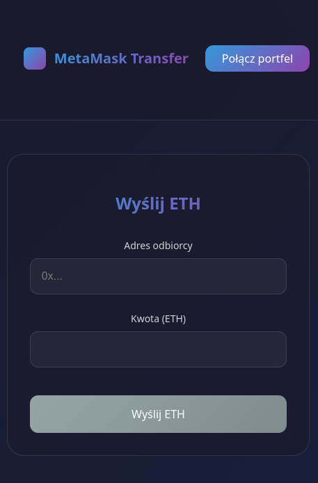
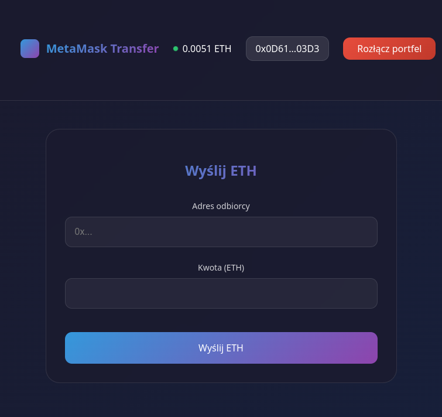

# Komponent do transferu środków z portfela na podany adres.

### instalacja i uruchomienie

Projekt tworzymy za pomocą Vite.

```
npm create vite@last
npm install
npm install web3
npm run dev
```

`MetaMaskTransfer.tsx` - plik komponentu react.
`MetaMaskTransfer.css` - plik stylu css dla komponentu.

Do pliku `App.tsx` dodajemy komponent

```
<MetaMaskTransfer 
  onSuccess={(txHash) => console.log('Transakcja udana:', txHash)}
  onError={(error) => console.error('Błąd:', error)}
/>
```

### interface aplikacji

#### Przed połączeniem portfela.


#### Po połączeniu portfela.


## Jak to działa

Prezentacja komponentu udostępniona w YouTube

[](https://youtu.be/vWN0ias7FZk)


